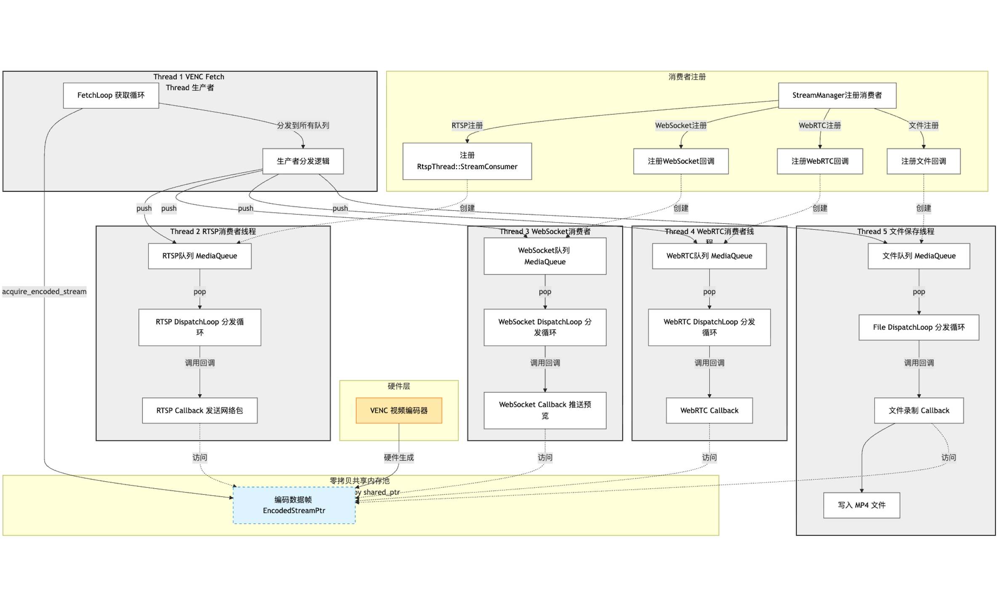
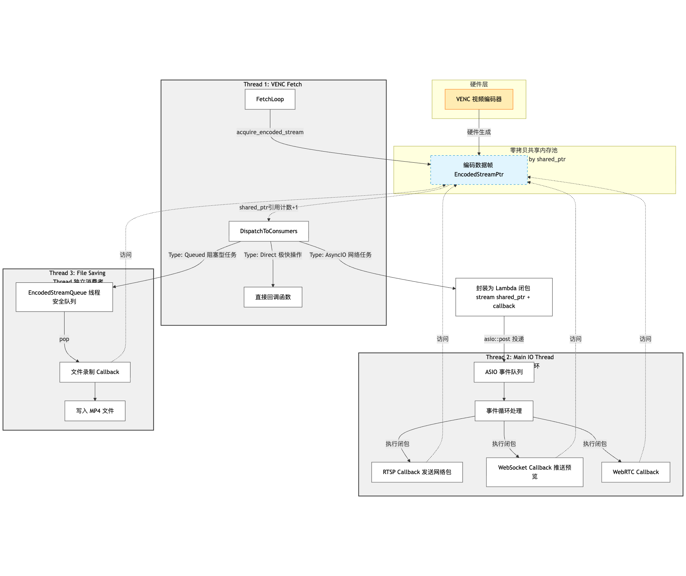

截止**tag: v0.4.0**，实现了：

1080p@15hz 下多路并发

- RTSP 推流

- 录制 mp4

- WebSocket 实时预览

个位数内存占用，无内存泄露，但是问题是：开启了过多的线程。

> 1080p@15hz 是实际测试，设计参数是1080p@30hz，后面再优化性能

::github{repo="Hyrsoft/aipc"}

因为我的设计原则是：**优先 Make it work，再说 Make it fast 和 better 的事**。在上述三个路径同时运行时，通过 Top 查看性能占用，RV1106 的单核 A7 占用会飙到 40%，内存占用倒不是很多，总占用才 35MB 左右（系统占用 29MB ），总内存有 256MB 呢（实际可用内存 144MB ）。

但问题是，之前使用 http 信令的 WebRTC 用于 Web 界面预览，在同时执行 RTSP 推流和 mp4 录制时，SOC 芯片明显发热。于是我决定把 Web 界面预览的操作用WebSocket 来简单实现，后期再说 WebRTC 的事。

在使用 WebSocket 进行 Web 界面预览时，运行效果良好，延时也低，但是运行几十秒后系统就会卡死，通过 Top 监控，不是 CPU 占用过高或者内存泄露的问题，暂不清楚。

> 后面发现是忘了插天线，导致网络压力大时ssh连接断开，我误以为系统卡死，难绷

于是决定先对当前并发逻辑进行优化，**从优先实现功能的多线程架构改为用 ASIO（epoll）来优化网络 IO 任务**，降低 CPU 占用，为后面引入 RKNN 推理打基础（虽然NPU推理大概率吃内存而不是CPU，但是先搞了再说）。

---


## 一、多线程架构：分发器+多消费者

目前实现的多线程架构，算是一步步 Vibe Coding 出来的，没有及时 Code Review，**复杂度已经上升到一种程度了：再不进行 Code Review 和重构，作为提示词咏唱魔法师的我已经完全看不懂了，更别说维护。**

因此在日志的这部分，将对这个架构进行一次解析，之后就用 ASIO 进行重构，力求提升可读性，降低复杂度。

> 对于 VENC 编码流的处理（RTSP、WebRTC、文件保存、WebSocket网页预览），采用分发器 + 多消费者模式：
>
> - 一个获取线程：从 VENC 获取编码流
>
> - 多个消费者线程：RTSP、WebRTC、文件保存、WebSocket网页预览各自独立的消费者
>
> 设计理念：
>
> - 零拷贝：所有消费者共享同一内存块（通过 shared_ptr 引用计数）
>
> - 解耦：任一消费者处理慢不影响其他消费者
>
> - 扩展性好：新增功能只需注册新消费者

### 1. 视频流的获取路径

在`main`函数中，开启流分发

```cpp
# src/main.cpp 
// 启动流分发
stream_manager_start();
```

启动分发器

```cpp
# src/thread_stream.cpp
// class StreamDispatcher  
void Start() {
    if (running_) return;
    running_ = true;

    // 先启动消费者分发线程（确保它们准备好接收数据）
    for (auto& c : consumers_) {
        c.thread = std::thread(&StreamDispatcher::DispatchLoop, this, &c);
        LOG_DEBUG("Started dispatch thread for consumer: {}", c.name);
    }

    // 短暂延迟，确保消费者线程就绪
    std::this_thread::sleep_for(std::chrono::milliseconds(50));

    // 最后启动获取线程
    fetch_thread_ = std::thread(&StreamDispatcher::FetchLoop, this);

    LOG_INFO("StreamDispatcher started with {} consumers", consumers_.size());
}
```

整个编码视频流的生产者线程

```cpp
# src/thread_stream.cpp
// class StreamDispatcher 
/**
 * @brief 获取循环 - 从 VENC 获取编码流并分发到各队列
 * 
 * 使用零拷贝共享：多个消费者共享同一个 VENC buffer
 * shared_ptr 引用计数管理，最后一个使用者释放时调用 ReleaseStream
 */
void FetchLoop() {
    LOG_DEBUG("Fetch loop started for VENC channel {}", venc_chn_id_);

    uint64_t frameCount = 0;
    uint64_t errorCount = 0;

    while (running_) {
        // 从 VENC 获取编码流（零拷贝，shared_ptr 管理生命周期）
        auto stream = acquire_encoded_stream(venc_chn_id_, 1000);  // 1秒超时

        if (!stream) {
            errorCount++;
            if (errorCount % 5 == 1) {  // 每5次错误打印一次
                LOG_WARN("Failed to get stream from VENC channel {} (error #{})", 
                         venc_chn_id_, errorCount);
            }
            continue;
        }

        frameCount++;
        errorCount = 0;  // 重置错误计数

        // 打印帧信息
        if (frameCount <= 5 || frameCount % 30 == 0) {
            LOG_DEBUG("Got frame #{}, size={} bytes", 
                     frameCount, stream->pstPack ? stream->pstPack->u32Len : 0);
        }

        // 分发给所有消费者（零拷贝，只是增加引用计数）
        for (auto& c : consumers_) {
            c.queue->push(stream);  // shared_ptr 拷贝，引用计数 +1
        }

        // stream 在这里离开作用域后，引用计数 -1
        // 当所有消费者都处理完毕后，最后一个释放时会调用 ReleaseStream
    }

    LOG_DEBUG("Fetch loop exited, total frames: {}", frameCount);
}
```

其中，`auto stream = acquire_encoded_stream(venc_chn_id_, 1000);`获取的是`std::shared_ptr`封装的编码流`EncodedStreamPtr`，确保多消费者场景下的正确生命周期管理，具体参考：[毕设日志（二）Luckfox-RKMPI示例的资源管理分析](https://hyrsoft.github.io/posts/linux/%E6%AF%95%E4%B8%9A%E8%AE%BE%E8%AE%A1%E6%99%BA%E8%83%BD%E7%BD%91%E7%BB%9C%E6%91%84%E5%83%8F%E5%A4%B4/luckfox-rkmpi%E7%A4%BA%E4%BE%8B%E7%9A%84%E8%B5%84%E6%BA%90%E7%AE%A1%E7%90%86/)


### 2. 生产者向消费者的数据传输：队列

生产者线程向消费者线程传递编码数据流`EncodedStreamPtr`，通过一个特殊的队列，每个消费者都维护一个队列

```cpp
# src/common/media_buffer.h
// ============================================================================
// 线程安全的媒体队列 - 用于模块间数据分发
// ============================================================================

/**
 * @brief 线程安全的媒体缓冲队列
 * 
 * 用于 VENC -> RTSP/WebRTC 的数据分发
 * 支持有界队列，超出容量时自动丢弃最旧的帧（背压处理）
 * 
 * @tparam T 媒体数据类型（VideoFramePtr 或 EncodedStreamPtr）
 */
template <typename T>
class MediaQueue {
public:
  		// 具体实现见：https://github.com/Hyrsoft/aipc/blob/main/src/common/media_buffer.h
}
```

消费者线程从它们单独维护的队列中获取编码数据帧`EncodedStreamPtr`


### 3. 消费者的注册、线程启动和数据流转

#### 注册

**消费者线程将自己的流消费者回调函数注册到 StreamDispatcher （生产者）**

`StreamManager`（在 `src/thread_stream.cpp`） 它负责初始化各个业务模块（RTSP、File等）。

以消费者 RTSP 为例：

```cpp
# src/thread_stream.cpp
StreamManager::StreamManager(const StreamConfig& config)
    : config_(config) {
    
    LOG_INFO("Creating StreamManager...");
    
    // 创建 RTSP 线程（如果启用）
    if (config_.enable_rtsp) {
        rtsp_thread_ = std::make_unique<RtspThread>(config_.rtsp_config);
        
        if (rtsp_thread_->IsValid()) {
            // 注册 RTSP 消费者到流分发器
            rkvideo_register_stream_consumer(
                "rtsp",
                &RtspThread::StreamConsumer,
                rtsp_thread_.get(),
                3  // 队列大小
            );
            LOG_INFO("RTSP consumer registered");
        } else {
            LOG_ERROR("Failed to create RTSP thread");
            rtsp_thread_.reset();
        }
    }
    
    // 创建文件保存线程（如果启用）
		// ......
    
    // 创建 WebRTC 线程（如果启用）
		// ......
    
    // 创建 WebSocket 预览服务器（如果启用）
		// ......
    
    LOG_INFO("StreamManager created");
}
```

这里传递了一个关键的东西：**回调函数指针** (`&RtspThread::StreamConsumer`)。这相当于 RTSP 模块说：“以后有视频帧了，请调用这个函数给我。”

`StreamDispatcher`（实例为`g_dispatcher`） 收到注册请求后，在其内部列表 `consumers_` 中增加一项。 

```cpp
# src/rkvideo/rkvideo.cpp
int rkvideo_init() {
  
  	// ......
		// 创建流分发器
    g_dispatcher = std::make_unique<StreamDispatcher>(0);
    
    // 注册已登记的消费者
    {
        std::lock_guard<std::mutex> lock(g_consumerMutex);
        for (const auto& reg : g_pendingConsumers) {
            g_dispatcher->RegisterConsumer(reg.name, 
                [reg](EncodedStreamPtr stream) {
                    if (reg.callback) {
                        reg.callback(stream, reg.userData);
                    }
                }, 
                reg.queueSize);
        }
        g_pendingConsumers.clear();
    }
  	return 0;
  
  	// ......
}
```

它同时为这个消费者创建了一个**专属队列 (`EncodedStreamQueue`)**。

```cpp
# src/rkvideo/stream_dispatcher.h
/**
 * @brief 注册流消费者
 * 
 * @param name 消费者名称（用于日志）
 * @param consumer 消费者回调函数
 * @param queue_size 消费者队列大小（背压控制）
 */
void RegisterConsumer(const std::string& name, StreamConsumer consumer, size_t queue_size = 3) {
  	
  	// 在增加消费者的同时，创建了一个专属队列
    consumers_.push_back({name, consumer, std::make_unique<EncodedStreamQueue>(queue_size)});
    LOG_INFO("Registered stream consumer: {}", name);
}
```

#### 启动线程

为每个消费者创建线程，并创建获取数据流的线程（生产者）

```cpp
# src/rkvideo/stream_dispatcher.h

// Class StreamDispatcher
/**
 * @brief 启动分发器
 * 
 * 启动后会创建：
 * 1. 多个分发线程：为每个消费者分发数据（先启动，确保准备就绪）
 * 2. 一个获取线程：从 VENC 获取编码流
 */
void Start() {
    if (running_) return;
    running_ = true;
		
  	// 依次启动所有消费者，每个都创建一个线程
    for (auto& c : consumers_) {
        c.thread = std::thread(&StreamDispatcher::DispatchLoop, this, &c);
        LOG_DEBUG("Started dispatch thread for consumer: {}", c.name);
    }

    // 短暂延迟，确保消费者线程就绪
    std::this_thread::sleep_for(std::chrono::milliseconds(50));

    // 最后启动获取线程
    fetch_thread_ = std::thread(&StreamDispatcher::FetchLoop, this);

    LOG_INFO("StreamDispatcher started with {} consumers", consumers_.size());
}
```

#### 运行（数据流转）

1. 生产者 (FetchLoop 线程)
   - 从 VENC 拿到 `EncodedStreamPtr` (shared_ptr)。
   - 它遍历所有消费者，把同一份指针 `push` 到它们各自的队列中。

2. 缓冲 (MediaQueue)

   每个消费者都有自己独立的队列。RTSP 处理慢了，只会堆积 RTSP 的队列，不会影响文件录制的队列。所谓解耦。

3. 消费者 (DispatchLoop 线程)

   **注意：RTSP 的回调函数不是在 RTSP 自己的网络线程里执行的，而是在这个专门的“分发线程”里执行的。**

	- **唤醒**：当队列有数据，`DispatchLoop` 被唤醒。

	- **执行回调**：

    ```cpp
    # src/rkvideo/stream_dispatcher.h 
    /**
     * @brief 分发循环 - 从队列取出数据并调用消费者回调
     */
    void DispatchLoop(ConsumerInfo* consumer) {
        LOG_DEBUG("Dispatch loop started for consumer: {}", consumer->name);
   
        uint64_t processedCount = 0;
        while (running_) {
            EncodedStreamPtr stream;
            // 尝试从队列中pop出数据
            if (consumer->queue->pop(stream, 1000)) {  // 1秒超时
                if (stream && consumer->callback) {
                    processedCount++;
                    if (processedCount <= 5 || processedCount % 30 == 0) {
                        LOG_DEBUG("Consumer {} processing frame #{}, ref_count={}", 
                                 consumer->name, processedCount, stream.use_count());
                    }
                    consumer->callback(stream); // <--- 这里调用了 RtspThread::StreamConsumer
                }
            }
        }
   
        LOG_DEBUG("Dispatch loop exited for consumer: {}, processed {} frames", 
                 consumer->name, processedCount);
    }
    ```

    - **最终发送**： 代码跳转到 `src/rtsp/thread_rtsp.cpp` 的 `StreamConsumer`，最终调用 `SendVideoFrame` 把数据塞给网络库（Live555或其他）。

    ```cpp
   # src/rtsp/rk_rtsp.cpp
   bool RtspServer::SendVideoFrame(const EncodedStreamPtr& stream) {
      if (!initialized_ || !stream || !stream->pstPack) {
          LOG_WARN("SendVideoFrame: invalid state or stream");
          return false;
      }
   
      // 从 MPI buffer 获取虚拟地址
      void* data = RK_MPI_MB_Handle2VirAddr(stream->pstPack->pMbBlk);
      if (!data) {
          LOG_ERROR("Failed to get virtual address from MB handle");
          stats_.errors++;
          return false;
      }
   
      LOG_TRACE("SendVideoFrame: len={}, pts={}", stream->pstPack->u32Len, stream->pstPack->u64PTS);
   
      return SendVideoData(
          static_cast<const uint8_t*>(data),
          stream->pstPack->u32Len,
          stream->pstPack->u64PTS
      );
   }
    ```

### 4. 总结

当前的架构可以理解为：**“1个生产者 + N个搬运工线程 + N个队列”**

**这是疏于Code Review的Vibe Coding产物**，力求快速实现功能，它目前的问题是：

- 消费者注册与对应回调函数注册繁琐
- 消费者线程生命周期管理复杂：需要进行`running_`判断和手动`join()`，容易造成死锁，难以维护
- 单核CPU上多线程上下文切换代价大



> 单看流程图就头大了

## 二、引入 ASIO 后的事件驱动模型

**系统现在采用“1个获取线程 + 1个主 IO 线程 + 1个文件线程”的精简模式，详情见tag: v0.5.0**

其中：

- 获取线程与多线程模型相同
- 主 IO 线程通过 ASIO 事件驱动模型调度 RTSP、WebSocket、WebRTC 等网络 IO 任务
- 文件线程负责 mp4 视频录制

原模型中“N个队列”的数据传输模式也修改了：

- 主IO线程的多个任务直接通过 Lambda 闭包封装一份编码数据帧的引用，不用通过队列传递
- 文件线程通过队列获取

### 1. 视频流的获取路径

该模型下视频流的获取路径和多线程模型基本相同

```cpp
# src/rkvideo/stream_dispatcher.h
// class StreamDispatcher
/**
 * @brief 启动分发器
 * 
 * 启动后会创建：
 * 1. 一个 Fetch 线程：从 VENC 获取编码流并直接分发
 * 2. Queued 类型消费者的独立处理线程
 */
void Start() {
    if (running_) return;
    running_ = true;

    // 启动 Queued 类型消费者的处理线程
    for (auto& c : consumers_) {
        if (c.type == ConsumerType::Queued && c.queue) {
            c.thread = std::thread(&StreamDispatcher::QueuedConsumerLoop, this, &c);
            LOG_DEBUG("Started queued consumer thread for: {}", c.name);
        }
    }

    // 短暂延迟，确保 Queued 消费者线程就绪
    if (HasQueuedConsumers()) {
        std::this_thread::sleep_for(std::chrono::milliseconds(50));
    }

    // 启动 Fetch 线程
    fetch_thread_ = std::thread(&StreamDispatcher::FetchLoop, this);

    LOG_INFO("StreamDispatcher started with {} consumers (optimized for single-core)", 
             consumers_.size());
}
```

### 2. 消费者的注册：AsyncIO 类型和 Queued 类型

消费者类型与结构体

```cpp
# src/rkvideo/stream_dispatcher.h
/**
 * @brief 消费者类型
 */
enum class ConsumerType {
    Direct,     ///< 直接在 Fetch 线程中执行（仅用于极快的操作）
    AsyncIO,    ///< 通过 asio::post 投递到 IO 线程执行（网络发送）
    Queued      ///< 通过队列投递到独立线程（文件写入等阻塞操作）
};

// class StreamDispatcher
struct ConsumerInfo {
    std::string name;
    StreamConsumer callback; 											// 回调函数
    ConsumerType type = ConsumerType::AsyncIO;		// 默认为 AsyncIO 类型
    std::unique_ptr<EncodedStreamQueue> queue;  	// 仅 Queued 类型使用
    std::thread thread;                          	// 仅 Queued 类型使用
};
```

消费者注册仍由流分发器负责

```cpp
# src/rkvideo/stream_dispatcher.h
// class StreamDispatcher
/**
 * @brief 注册流消费者
 * 
 * @param name 消费者名称（用于日志）
 * @param consumer 消费者回调函数
 * @param type 消费者类型，决定回调的执行方式
 * @param queue_size 队列大小（仅对 Queued 类型有效）
 */
void RegisterConsumer(const std::string& name, StreamConsumer consumer, 
                      ConsumerType type = ConsumerType::AsyncIO,
                      size_t queue_size = 3) {
    ConsumerInfo info;
    info.name = name;
    info.callback = consumer;
    info.type = type;

    // 只有 Queued 类型需要队列和线程
    if (type == ConsumerType::Queued) {
        info.queue = std::make_unique<EncodedStreamQueue>(queue_size);
    }

    consumers_.push_back(std::move(info));
    LOG_INFO("Registered stream consumer: {} (type={})", name, 
             type == ConsumerType::Direct ? "Direct" :
             type == ConsumerType::AsyncIO ? "AsyncIO" : "Queued");
}
```

### 3. 数据流转

该函数由生产者线程调用

- 对于 Direct 类型：直接在生产者线程中调用消费者回调
- 对于 AsyncIO 类型：将消费者回调通过 lambda 投递到IO线程到主IO循环中执行
- 对于 Queued 类型：放入队列，由专属线程处理

```cpp
# src/rkvideo/stream_dispatcher.h
/**
 * @brief 分发帧给所有消费者
 * 
 * 根据消费者类型选择不同的分发策略：
 * - Direct: 直接在当前线程调用
 * - AsyncIO: 通过 asio::post 投递到 IO 线程
 * - Queued: 放入消费者专属队列
 */
void DispatchToConsumers(EncodedStreamPtr stream) {
    for (auto& c : consumers_) {
        if (!c.callback) continue;

        switch (c.type) {
            case ConsumerType::Direct:
                // 直接在 Fetch 线程中执行（仅用于极快的操作）
                c.callback(stream);
                break;

            case ConsumerType::AsyncIO:
                // 投递到 IO 线程执行（网络发送）
                // 捕获 stream 的拷贝，增加引用计数
                PostToIo([callback = c.callback, stream]() {
                    callback(stream);
                });
                break;

            case ConsumerType::Queued:
                // 放入队列，由专属线程处理（文件写入）
                if (c.queue) {
                    c.queue->push(stream);
                }
                break;
        }
    }
}
```

`PostToIo`最终调用

```cpp
# src/common/asio_context.h
// class IoContext
/**
 * @brief 投递任务到 IO 线程执行
 * 
 * 线程安全，可从任意线程调用
 * 
 * @param handler 要执行的任务
 */
template<typename Handler>
void Post(Handler&& handler) {
    asio::post(io_context_, std::forward<Handler>(handler));
}
```

### 4. 任务闭包化：使用 Lambda 捕获与 ASIO 异步调度

对于 AsyncIO 类型消费者任务的处理，是使用 Lambda 表达式将“数据”与“行为”打包成一个**异步任务（Closure）**，直接投递至主 IO 线程的事件循环中

```cpp
# src/rkvideo/stream_dispatcher.h 中的核心逻辑
case ConsumerType::AsyncIO:
    // 将 stream 拷贝一份捕获到 lambda 中
		// 并非数据深拷贝，而是 shared_ptr 引用计数自动 +1
    PostToIo([callback = c.callback, stream]() {
        callback(stream); // 任务执行时，引用计数保证了 buffer 依然有效
    });
    break;
```

这种设计解决了原多线程编程中的生命周期问题和竞争问题：

**生命周期问题**：

- **生产者视角**：`FetchLoop` 只需要完成任务投递，随后 `stream` 离开局部作用域，引用计数减 1。
- **消费者视角**：只要主 IO 线程中的任务尚未执行完毕，Lambda 闭包就一直持有该 `stream` 的副本，引用计数不为 0，底层硬件 Buffer 就绝不会被 VENC 驱动释放。
- **无需手动维护**：一旦 `callback` 执行结束，Lambda 闭包销毁，引用计数降至 0，此时 `ReleaseStream` 会被自动触发，将 Buffer 归还硬件。

**消除上下文切换与竞争**：

在原有的“搬运工”模型中，RTSP 或 WebSocket 模块在发送数据前，往往需要先获取锁来从自己的队列中提取帧。而在 ASIO 模型下：

- **线程一致性**：所有的网络发送逻辑（RTSP 发送、WS 推送）全部运行在 `Main IO Thread` 这一同一个线程中。
- **无锁设计**：由于任务是顺序执行的，网络模块内部的发送缓冲区不再需要互斥锁来保护，消除了 CPU 在多个 Dispatch 线程间进行内核级切换的开销。

### 5. 总结



> 相比原多线程模型，流程图精简了不少，也提升了性能（砍了好几个不必要的线程）。
