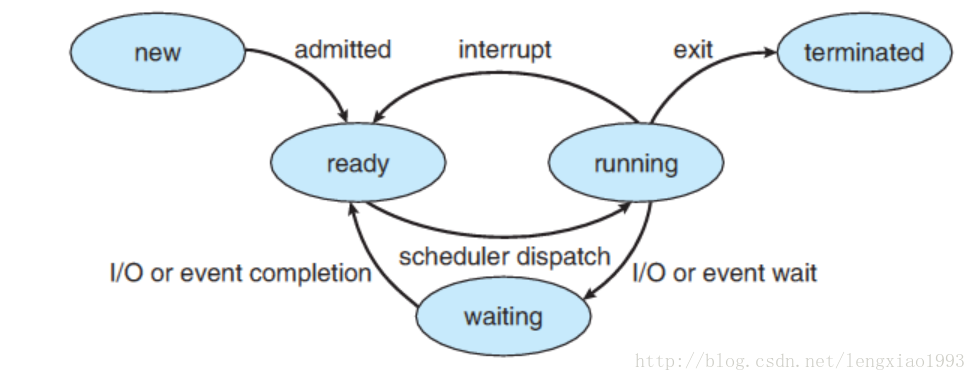

同步与异步，阻塞与非阻塞，真是异步编程中最难理解、最容易混淆的两对概念。

这个文章算是对该知乎回答的一个读书笔记

> 怎样理解阻塞非阻塞与同步异步的区别？ - 学刑法的程序员的回答 - 知乎
> https://www.zhihu.com/question/19732473/answer/241673170

这里有一个很容易误解的点：

> 同步 = 阻塞
> 异步 = 非阻塞


chatGPT 这样告诉我：

| 概念          | 关注点         |
| ------------- | -------------- |
| 同步 / 异步   | 结果的交付方式 |
| 阻塞 / 非阻塞 | 线程是否被挂起 |

涉及的东西实在太多，就分开来写好了。

---


我把对阻塞与非阻塞的讨论分为线程状态语义与IO模型语义，因为我发现在讨论中经常会把它们搞混。


## 一、 线程状态语义下的阻塞与非阻塞


线程状态语义就是指操作系统调度方面的语义，在 Linux 这种分时抢占式操作系统中，除了时间片轮转导致的线程调度，还包括线程被调度器挂起，进入**阻塞**状态，不再参与时间片调度，直到该线程被唤醒。

典型线程状态流转



> 核心问题只有：线程有没有进入waiting状态


### 1. 线程状态语义下的阻塞

阻塞 = 线程被内核挂起（sleep）

例子：

```cpp
std::this_thread::sleep_for(3s);		 // 主动进入sleep
read(fd, buf, size);   							// 默认阻塞的读取操作，阻塞 IO
pthread_mutex_lock();								// 互斥锁
```

共同点：

- 线程被调度器移出 run queue
- CPU 去执行别的线程
- 当前线程不占 CPU


一般阻塞操作都涉及系统调用，涉及用户态向内核态的切换，例如

- `read()`读取文件，
- `sleep()` 主动让出 CPU 使用权


### 2. 线程状态语义下的非阻塞

非阻塞 = 线程始终 runnable

例子：

```cpp
while(1);      											// 死循环
heavy_compute(); 										// 耗时的计算任务
read(fd, ...)  											// O_NONBLOCK 且立即返回，非阻塞 IO
```

即使卡住：

- 线程仍在 running
- 没有进入 waiting

值得注意的是，当线程处于非阻塞状态时，只意味着线程会持续参与调度器的时间片轮转，但不意味着执行流不会被打断。

---


## 二、 IO 模型语义下的阻塞与非阻塞

IO 模型有很多，但是这里只讨论阻塞与非阻塞


> 作者：学刑法的程序员
> 链接：https://www.zhihu.com/question/19732473/answer/241673170
> 来源：知乎
> 著作权归作者所有。商业转载请联系作者获得授权，非商业转载请注明出处。
>
> 
>
> ## I/O System Call 的阻塞/非阻塞， 同步/异步
>
> 这里再重新审视 **阻塞/非阻塞 IO** 这个概念， 其实**阻塞和非阻塞**描述的是进程的一个操作是否会使得进程转变为“等待”的状态， 但是为什么我们总是把它和 IO 连在一起讨论呢？
>
> 原因是， **阻塞**这个词是与系统调用 System Call 紧紧联系在一起的， 因为要让一个进程进入 等待（waiting） 的状态, 要么是它主动调用 wait() 或 sleep() 等挂起自己的操作， 另一种就是它调用 System Call, 而 System Call 因为涉及到了 I/O 操作， 不能立即完成， 于是内核就会先将该进程置为等待状态， 调度其他进程的运行， 等到 它所请求的 I/O 操作完成了以后， 再将其状态更改回 ready 。
>
> 操作系统内核在执行 System Call 时， CPU 需要与 IO 设备完成一系列物理通信上的交互， 其实再一次会涉及到阻塞和非阻塞的问题， 例如， 操作系统发起了一个读硬盘的请求后， 其实是向硬盘设备通过总线发出了一个请求，它即可以阻塞式地等待IO 设备的返回结果，也可以非阻塞式的继续其他的操作。 在现代计算机中，这些物理通信操作基本都是异步完成的， 即发出请求后， 等待 I/O 设备的中断信号后， 再来读取相应的设备缓冲区。 但是，大部分操作系统默认为用户级应用程序提供的都是阻塞式的系统调用 （blocking systemcall）接口， 因为阻塞式的调用，使得应用级代码的编写更容易（代码的执行顺序和编写顺序是一致的）。


### 1. 阻塞 IO

**线程调用 System Call，涉及 IO 操作，不能立即返回，于是内核就会先将该线程置为等待状态，等到它所请求的 IO 操作完成了以后， 再将其状态更改回 ready**。

> 内核帮你等

这里的 IO 操作就是**阻塞 IO**

例如

```cpp
#include <iostream>
#include <unistd.h>
#include <sys/socket.h>
#include <netinet/in.h>
#include <cstring>

int main() {
    int server_fd = socket(AF_INET, SOCK_STREAM, 0);

    sockaddr_in addr{};
    addr.sin_family = AF_INET;
    addr.sin_port = htons(8888);
    addr.sin_addr.s_addr = INADDR_ANY;

    bind(server_fd, (sockaddr*)&addr, sizeof(addr));
    listen(server_fd, 1);

    int client_fd = accept(server_fd, nullptr, nullptr);

    char buf[1024];

    std::cout << "等待数据...\n";

    // ⭐ 阻塞 IO
    int n = read(client_fd, buf, sizeof(buf));

    std::cout << "收到: " << std::string(buf, n) << "\n";

    close(client_fd);
    close(server_fd);
}

```


### 2. 非阻塞 IO

**进程调用 System Call，涉及 IO 操作，如果当前数据尚未就绪，内核不会将该进程置为等待状态，而是立即返回一个错误码（如 EAGAIN / EWOULDBLOCK），进程仍然保持 ready 状态，由用户决定稍后再次发起请求。**

> 内核不帮你等，自己决定怎么等

这里的 IO 操作就是**非阻塞 IO**

```cpp
#include <iostream>
#include <unistd.h>
#include <sys/socket.h>
#include <netinet/in.h>
#include <fcntl.h>
#include <cstring>

int main() {
    int server_fd = socket(AF_INET, SOCK_STREAM, 0);

    sockaddr_in addr{};
    addr.sin_family = AF_INET;
    addr.sin_port = htons(8888);
    addr.sin_addr.s_addr = INADDR_ANY;

    bind(server_fd, (sockaddr*)&addr, sizeof(addr));
    listen(server_fd, 1);

    int client_fd = accept(server_fd, nullptr, nullptr);

    // ⭐ 设置为非阻塞
    fcntl(client_fd, F_SETFL, O_NONBLOCK);

    char buf[1024];

    std::cout << "尝试读取数据...\n";

    int n = read(client_fd, buf, sizeof(buf));

    if (n < 0) {
        std::cout << "数据未就绪，立即返回\n";
    } else {
        std::cout << "收到: " << std::string(buf, n) << "\n";
    }

    close(client_fd);
    close(server_fd);
}

```

对于非阻塞 IO，获取数据结果有很多方式，暂时按下不表，只需知道：**非阻塞 IO 本身并不负责“自动交付”结果，它只负责在资源未就绪时“拒绝挂起线程”。**

---


## 三、 容易混淆的点：口语中的阻塞与操作系统中的阻塞


**阻塞**这个词在口语里代表**不动了**，而在底层开发里代表**线程状态的切换**。如果在主线程里写了一个死循环 `while(1);`，程序会彻底卡死，但这在内核看来，它是最“活跃”的非阻塞任务。

我们可以简单的把操作分为阻塞操作与非阻塞操作：

**阻塞操作**：使当前线程被挂起的操作

- 阻塞的 System Call，发生用户态向内核态的转换
- `sleep()` 主动进入 waiting，时间到后自动唤醒

**非阻塞操作**：持续占用 CPU 的操作

- 高负载计算任务
- `while(1)` 死循环

以上非阻塞操作，尽管它们在口语里使得当前线程**不动了**，但是它们是非阻塞的。

---


## 四、 轮询（Polling）是会阻塞操作线程吗？


### 1. 用户态忙轮询（busy polling）

```cpp
while (true) {
    if (data_ready()) {
        break;
    }
}
```

特点：

- 线程始终 running
- CPU 被吃满
- 没有进入 waiting

**线程语义：非阻塞**

**IO 模型语义：没有模型，只是暴力检查**

一般称之为：忙等（busy wait）。


### 2. Linux 的 `poll()` 系统调用


`poll()` 系统调用既可以是阻塞的，也可以是非阻塞的。对于 `poll()` 系统调用，涉及多路 IO 复用，这里只是简单介绍一下，暂不深入。

- 阻塞的 `poll()`

  ```c
  poll(fds, nfds, 5000);   // 等 5 秒
  poll(fds, nfds, -1);     // 无限等
  ```

  这种情况：

  - 当前线程进入内核
  - 若没有事件，线程被挂起（waiting）
  - 等待事件或超时唤醒

  **线程状态语义：阻塞**

  **IO 模型语义：IO 多路复用（非阻塞 IO 模型的一种）**

- 非阻塞的 `poll()`

  立即返回轮循

  ```c
  poll(fds, nfds, 0);
  ```

  这种情况：

  - 内核：检查是否有事件，没有就直接返回

  - 线程始终 runnable。

  **线程语义**：**非阻塞**
  
  **IO模型语义**：**仍然是 IO 多路复用**